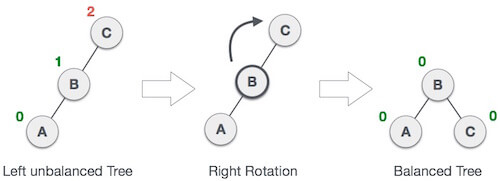
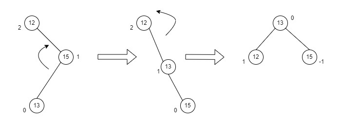

# Datastructures and Algorithms in java

### linear data structure

1. [Array]()
2. [stack]()
3. [queue]()
4. [linked list]()

### non-linear data structure
1. [Trees]()
   1. [BS Trees]()
   2. [Heap Trees](#heap-trees)
   3. [AVL Trees](#avl-trees-)
   4. [B Trees]()
   5. [Splay Trees]()
2. [Graphs]()


### Heap Trees
   Heaps trees are always complete and has at most two children
   
   1. **Max Heap** : The value of the parent node should be greater than or equal to either of its children.
   2. **Min Heap** : The value of the parent node should be less than or equal to either of its children.
   
   _Heaps are mainly implemented using arrays_    

* **Important equations :** 

   * leftNodeIndex = 2 * parentNodeIndex + 1
   * rightNodeIndex = 2 * parentNodeIndex + 2
   * parentNodeIndex = (childNodeIndex - 1) / 2

### Avl Trees 
AVL Tree is invented by GM Adelson - Velsky and EM Landis in 1962.

#### Balance(node) = Height(node.left) - Height(node.right)
when we calculate the balance factor for a balanced tree it must be in **[-1,0,1]**

Sometimes trees are not balance, or we can call it skewed thus the time complexity 
can be extended to **O(n)** similar to linked list


So AVL tree came to solve this problem by balancing 
itself in all operations using rotations

#### 1. Left Rotation 
   _to solve right heavy situation (RR)_ <br>
   rotate to the left in case the node unbalanced to the right <br>
   balance factor is less than -1

   

#### 2. Right Rotation
   _to solve left heavy situation (LL) _ <br>
   rotate to the right in case the node unbalanced to the left <br>
   balance factor is greater than 1

   

#### 3. Left Right Rotation
   when the balance factor of left child is negative and the parent is unbalanced with positive factor <br>
   **First**, we left rotate the left child<br>
   **Then**, right rotate the node

   

#### 4. Right Left Rotation
   when the balance factor of right child is positive and the parent is unbalanced with negative factor <br>
   **First**, we right rotate the right child<br>
   **Then**, left rotate the node

   

### Red-black Trees
Red-Black tree is a self-balancing binary search tree in which 
each node contains an extra color field, either red or black.

**Properties of a Red-Black Tree:**
1. Every node is either red or black.
2. The root is always black.
3. Red nodes cannot have red children
4. Every path from a node to leaves must have the same number of black nodes (black height).

**How Insertion Works**

1. first create new node with the inserted value
2. assign the root to the insert helper function
3. recolor and rotate inserted node
4. return this for chain insert statements

```java
    @Override
    public ITree<T> insert(T value) {
        RBNode<T> nodeToInsert = new RBNode<>(value);
        root = insert(root,nodeToInsert);
        coloringAndRotation(nodeToInsert);
        return this;
    }
```

call updateNodeParent method to update the parent of each inserted node

```java
    private RBNode<T> insert(RBNode<T> node , RBNode<T> nodeToInsert) {
   if (node == null) {
      return nodeToInsert;
   }
   if (nodeToInsert.value.compareTo(node.value) > 0) {
      node.right = insert(node.right , nodeToInsert);
      updateNodeParent(node.right , node);
   } else {
      node.left = insert(node.left , nodeToInsert);
      updateNodeParent(node.left , node);
   }
   return node;
}
```

* only if the parent of the inserted node is red we recolor or rotate
* if no uncle or uncle is red recolor only
* if uncle is black and parent is a left child
   * if node is right child
      * rotate left 
      * recolor and rotate grandparent
      * rotate right
      * flip colors of parent and grandparent
   * if node is left child
      * recolor and rotate parent
      * rotate right
      * flip colors of parent and grandparent
      
* if uncle is black and parent is a right child
   * if node is left child
      * rotate right
      * recolor and rotate grandparent
      * rotate left
      * flip colors of parent and grandparent
   * if node is right child
      * recolor and rotate parent
      * rotate left
      * flip colors of parent and grandparent
```java
    private void coloringAndRotation(RBNode<T> node) {
        RBNode<T> parent = node.parent;
        if (node != root && parent.color == NodeColor.RED) {
            RBNode<T> grandParent = node.getGrandParent();
            RBNode<T> uncle = node.getUncle();
            
            if (uncle != null && uncle.color == NodeColor.RED) {
                handleRecoloring(parent , uncle , grandParent);
            } else if (parent.isLeftChild()) {
                handleLeftSituation(node , parent , grandParent);
            } else if (parent.isRightChild()) {
                handleRightSituation(node , parent , grandParent);
            }
        }

        node.color = NodeColor.BLACK;
    }
```
**Deletion**
deletion Red Black Trees is a bit harder than insertion <br>
you can read [this article](https://adroit-things.com/data-structures/red-black-trees-deletion/)


### Splay Trees

### Tries (prefix tree) 
* Trie is a tree-based data structure used for storing and searching for keys in a set

* Trie is a type of k-ary search tree
  
Uses:
1. Strings fast lookup
2. Long prefixes matching
3. Takes less space (nodes shared between keys)
4. Text autocompletion

learn more [here](https://www.scaler.com/topics/data-structures/trie-data-structure/)

## Sources

1.  [Java Point](https://www.javatpoint.com/data-structure-tutorial)
2.  [Tutorial Point](https://www.tutorialspoint.com/data_structures_algorithms/index.htm)